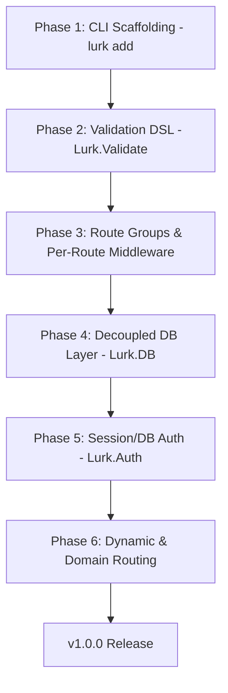

# Lurk Framework: v1.0.0 Readiness & Competitor Analysis

To compete directly with the **"Big 4"** (Laravel, Django, Next.js, Rails) and serve as a robust, general-purpose framework for all kinds of web applications (including SaaS, enterprise platforms, APIs, and real-time systems), Lurk must establish extensible foundations that prevent future technical debt or complex refactoring.

This document details the architectural requirements, design decisions, and v1 roadmap to achieve this goal.

---

## 1. Competitive Positioning & Core Philosophy

Lurk’s primary competitive advantages are:
1.  **Compile-Time Guarantees**: Type-safe HTML rendering, compile-safe configurations, and type-safe routing.
2.  **Performance & Resource Efficiency**: Native binary execution, sub-millisecond rendering times, low memory footprints (~10MB RAM), and instant cold starts.
3.  **Zero-Configuration Defaults with Enterprise Scalability**: Ready to run out of the box (e.g. SQLite + file-backed sessions) but designed with pluggable typeclasses to scale to multi-node clusters (e.g. PostgreSQL + Redis) without modifying business logic.

---

## 2. v1 Foundations for General-Purpose Web Apps

To prevent future technical debt when scaling from simple pages to large-scale SaaS or enterprise applications, Lurk must implement these structural features.

### A. Pluggable Backends via Typeclasses (Extensibility)
For general-purpose apps, hardcoding storage, session, or mail mechanisms is a major source of technical debt. We must decouple all system operations using typeclasses:

*   **Database Layer (`Lurk.DB`)**: Define a pluggable provider interface:
    ```haskell
    class DatabaseProvider db where
        querySQL   :: (FromRow row, ToRow params) => db -> Query -> params -> IO [row]
        executeSQL :: ToRow params => db -> Query -> params -> IO Int64
    ```
    This enables seamless transition from `SQLiteStore` (development) to `PostgresStore` (production/scale) simply by changing environment variables, with no changes to queries or record definitions.
*   **Session Store (`Lurk.Session`)**: Ensure the session middleware interacts with a generic store typeclass, allowing seamless swap from [InMemoryStore](file:///home/fer/Proyectos/website/lib/lurk/Lurk/Session.hs#L65-L68) / [FileStore](file:///home/fer/Proyectos/website/lib/lurk/Lurk/Session.hs#L69-L74) to `RedisStore` or `PostgresSessionStore` when scaling horizontally across multi-node clusters.
*   **Email Client (`Lurk.Email`)**: Abstract SMTP behind a `MailProvider` typeclass:
    
    ```haskell
    class MailProvider p where
        sendMail :: p -> Email -> IO (Either EmailError ())
    ```
    This allows swapping from raw SMTP ([Lurk.Email.SMTP](file:///home/fer/Proyectos/website/lib/lurk/Lurk/Email/SMTP.hs)) to third-party HTTP mail APIs (Resend, Mailgun, AWS SES) without modifying controller actions.

### B. Dynamic & Tenant Routing (CMS & SaaS Scope)
General-purpose web applications require dynamic path matching and tenant routing:
*   **Path Parameters (`/:id` / `/:slug`)**: Expose type-safe parameter extraction helpers mapping Scotty's dynamic route parser to static, localized path functions:
    ```haskell
    -- Router matches path parameter variables
    getPages blogPostPath blogPostAction
    ```
*   **Host-Based / Subdomain Routing**: Multi-tenant SaaS applications need to dispatch subdomains or custom domains to independent sub-routers. We must introduce a `domainRouter` middleware wrapper at the root:
    
    ```haskell
    router :: LurkApp
    router = do
        routeSettings [ TrailingSlashes, ForceSSL ]
        domainRouter $ \subdomain -> case subdomain of
            "app"   -> appRouter      -- SaaS app
            "admin" -> adminRouter    -- Dashboard
            _       -> marketingRouter -- Public website
    ```

### C. Route-Specific and Group Middleware
For APIs, admin dashboards, and webhook receivers, applying all WAI middlewares globally (e.g. forcing CSRF or sessions everywhere) creates design issues. We need a routing mechanism to group routes with specific pipelines:
```haskell
router :: LurkApp
router = do
    -- Global settings
    routeSettings [ TrailingSlashes ]
    
    -- Public routes
    get homePath homeAction
    
    -- Protected API routes (CSRF bypassed, Rate Limited, Token Auth)
    routeGroup [ apiTokenAuth, rateLimit 60 ] $ do
        post apiWebhookPath webhookAction
```

### D. Compile-Time Safe Authorization (`Lurk.Auth`)
Standard frameworks perform authorization checks dynamically at runtime (e.g., using decorators or policies). If a developer forgets to secure a route, the app fails open.
Lurk will implement **Proof-Carrying Tokens** to enforce security at build time:
```haskell
-- Protected controller functions require compile-proof credentials
deleteRecordAction :: AuthProof -> RecordId -> Action ()
deleteRecordAction proof recId = ...
```
By forcing functions to demand an `AuthProof` token, GHC guarantees that a route cannot execute a protected action unless it has first passed through `requireAuth`.

### E. Composable Input Validation DSL (`Lurk.Validate`)
Complex business applications require robust, nested form and API input validations. Writing custom controllers with nested `if`/`else` statements introduces massive technical debt. 
We need a monadic/applicative validation engine that yields typed schemas from form parameters:

```haskell
validateRegistration :: FormData -> Either ValidationErrors RegistrationData
validateRegistration fd = runValidation fd $ do
    email    <- field "email" [required, isEmail, maxLength 100]
    password <- field "password" [required, minLength 8, matches "confirm_password"]
    role     <- field "role" [required, oneOf ["user", "manager"]]
    pure $ RegistrationData email password role
```

### F. Scaffolding & Code Generation CLI (`lurk add`)
To compete on developer velocity with Laravel or Rails, Lurk must offer robust generators:
*   `lurk add model [Name]`: Scaffolds DB record types, table migrations, and repository queries.

---

## 3. Phased Implementation Roadmap

To avoid code conflicts and regression, we must implement features in this structural order:


